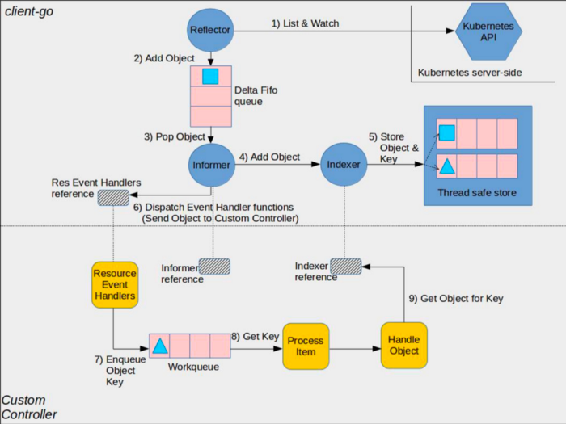

# PersistentVolumeKubeController

This is a custom controller for Kubernetes. It watches for PersistentVolumes (PV)  objects and manages them.

When a PV is created, the controller will create an event of creation. By default, kubernetes cluster 1.29 does not create PV creation and deletion event.

## How it works

The controller runs inside the cluster and uses the Kubernetes apiserver to watch PVs. It creates and manages PVs to match those claims.

Here is a diagram that shows the idea:



- The controller is running as a pod in the cluster, or even as a OS service running on control plane node.
- It listens for changes in PV's on ETCD by apiserver.

## Running controller

```bash
cd pvController
go get <dependencies>
go build -o pv_controller .
./pv_controller
```
